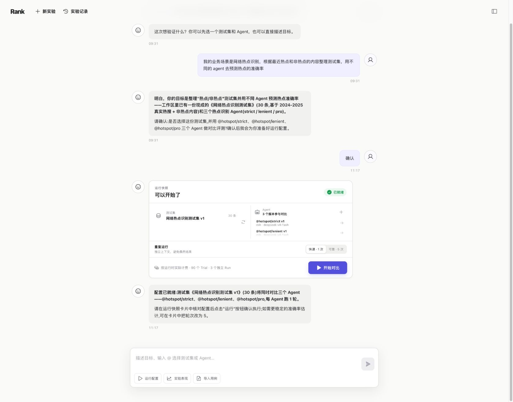
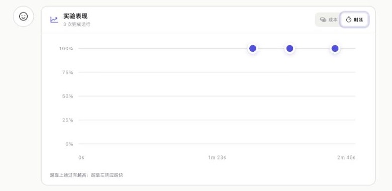

# Chat2Ranker

[](https://www.npmjs.com/package/@xyzbit/chat2ranker) [](https://github.com/xyzbit/chat2ranker/releases/latest) [](https://github.com/xyzbit/chat2ranker/actions/workflows/ci.yml) [](LICENSE)

English | [中文](README.zh.md)

Prepare datasets, configure agents, and run reproducible evaluations through conversation. No evaluation script is required up front.

<a id="run"></a>

## Start in one minute

Requires Node.js 22.19 or newer on macOS or Linux, x64 or arm64.

```sh
npx -y @xyzbit/chat2ranker@latest start
```

On first open, choose a provider and model, then enter an API key. Describe the outcome you want, such as “Build a Web research dataset and compare two agents on accuracy and cost.” Rank asks only for missing information and waits for explicit confirmation in the run card.



See the [one-minute quick start](rank/docs/quickstart.md) for first-run setup, background operation, and isolated data directories.

## From conversation to comparable results

- **Prepare:** create or select versioned datasets and agent configurations through conversation.
- **Run:** isolate every trial and compare multiple agent versions in one run group.
- **Evaluate:** prefer deterministic checks and invoke rubric-based LLM judging only when semantic evaluation is needed.
- **Inspect:** aggregate pass rate, stable cases, cost, duration, failures, and raw execution artifacts.



## Harnesses and architecture

[DeepSeek Harness](https://github.com/deepseek-ai/deepseek-harness) is the first-party runtime and control-conversation foundation. Pi, Claude Code, Codex, and Hermes connect through peer Runner adapters; an uninstalled or unconfigured Runner is not presented as runnable.

The Go Rank service owns experiments, frozen versions, scheduling, and aggregation. The Execution Service runs candidates and judges in isolated processes or sandboxes. Read the [system architecture](rank/docs/architecture.md) and [core data flow](rank/docs/core-data-flow.md) for details.

## Run from source

```sh
git clone https://github.com/xyzbit/chat2ranker.git
cd chat2ranker
pnpm install
pnpm rank:dev
```

See [local development and acceptance](rank/docs/local-acceptance.md) for source prerequisites, health checks, and acceptance flows. See the [repository structure](rank/docs/project-structure.md) for code ownership.

## Contributing

Issues and pull requests are welcome. If Chat2Ranker is useful to you, consider starring the repository.

Released under the [MIT License](LICENSE).
