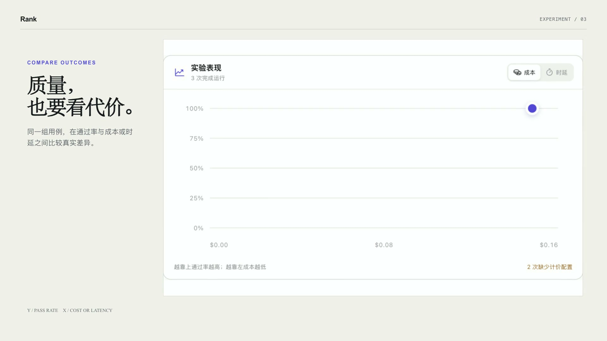

# Chat2Ranker

[](https://www.npmjs.com/package/@xyzbit/chat2ranker) [](https://github.com/xyzbit/chat2ranker/releases/latest) [](https://github.com/xyzbit/chat2ranker/actions/workflows/ci.yml) [](LICENSE)

[English](README.md) | 中文

Chat2Ranker 把一个目标变成版本化测试集、可比较的 Agent 运行和可追溯证据。无需先编写评测脚本。

## 可以比较什么？

- **最新模型效果**：固定测试集、Harness、工具和评审规则，从通过率、成本、耗时与稳定性比较模型版本。
- **不同 Harness**：让同一个模型在 DeepSeek Harness、Codex、Claude Code 或 Hermes 中运行相同用例，测出运行时差异。
- **不同 Agent 配置**：自由组合模型、System Prompt、工具和 Skill，在一个实验中比较冻结后的 Agent 版本。
- **版本回归**：发布前重复运行，定位不稳定用例，并查看失败原因与执行轨迹。

## 看一次完整实验

[](rank/docs/assets/chat2ranker-demo.mp4)

描述一个目标，让 Rank 准备可复用的数据与 Agents，确认运行，用成本或时延对照质量；需要细节时再展开侧边工作区。点击图片可查看 1080p 视频。

<a id="run"></a>

## 一分钟开始

需要 Node.js 22.19 或更高版本，支持 macOS 和 Linux 的 x64、arm64 环境。

```sh
npx -y @xyzbit/chat2ranker@latest start
```

首次打开时选择 Provider 和模型，再填写 API Key。随后直接描述目标，例如“整理一组 Web 研究用例，对比两个 Agent 的准确率和成本”。Rank 只会询问缺少的信息，并在运行确认卡中等待你明确开始。

完整的首次使用、后台运行和独立数据目录说明见[一分钟上手](rank/docs/quickstart.md)。

## 从对话到可比较的结果

- **准备**：通过对话创建或选择版本化的测试集与 Agent 配置。
- **运行**：每个 Trial 使用独立上下文；一个运行组可同时比较多个 Agent 版本。
- **评审**：优先使用确定性规则，只有需要语义判断时才调用 Rubric 与 LLM Judge。
- **分析**：汇总通过率、稳定用例、成本、耗时、失败原因和原始执行产物。

## Harness 与架构

[DeepSeek Harness](https://github.com/deepseek-ai/deepseek-harness) 是第一方运行时和控制对话基础。Pi、Claude Code、Codex 与 Hermes 通过平级 Runner Adapter 接入，未安装或未配置的 Runner 不会显示为可运行。

Go Rank 服务负责实验、版本冻结、调度和结果聚合；Execution Service 在隔离的进程或 Sandbox 中执行 Candidate 与 Judge。更多内容见[系统架构](rank/docs/architecture.md)和[核心数据流](rank/docs/core-data-flow.md)。

## 从源码运行

```sh
git clone https://github.com/xyzbit/chat2ranker.git
cd chat2ranker
pnpm install
pnpm rank:dev
```

源码开发、服务健康检查和完整验收见[本地开发与验收](rank/docs/local-acceptance.md)。仓库布局见[项目结构](rank/docs/project-structure.md)。

## 参与项目

欢迎提交 Issue 和 Pull Request。如果 Chat2Ranker 对你有帮助，也欢迎给仓库一个 Star。

本项目采用 [MIT License](LICENSE)。
