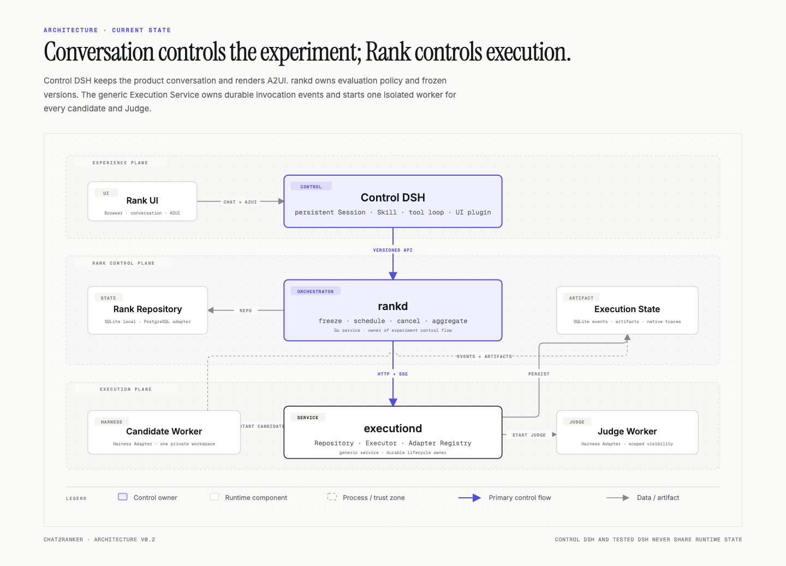

# System architecture

chat2ranker separates conversational control, experiment orchestration, and tested harness execution into different runtime roles.

## Runtime roles

| Role | Process | Owns | Must not own |
|---|---|---|---|
| Rank UI | Browser | Conversation presentation and A2UI actions | Business persistence or Runner lifecycle |
| Control DSH | Node host | Persistent control Session, Skill execution, tool loop, and UI plugin runtime | Tested case execution |
| Rank Orchestrator | Go `rankd` | Dataset, agent, and evaluator versions; experiments; Case × Trial scheduling; judging policy; aggregation; cancellation | Harness processes, Sandboxes, or execution persistence |
| Execution Service | Go `executiond` | Generic execution records, idempotent submission, Executor selection, cancellation, artifacts, and recovery | Rank experiments, datasets, agents, or scoring policy |
| Execution Worker | Go `execution-worker` | One isolated harness invocation, progress events, and normalized terminal result | Rank or Execution Service databases |
| Harness Adapter | Public worker component | DSH, Pi, Claude Code, Codex, Hermes, or another harness CLI/SDK invocation | Scheduling or business persistence |
| Judge Runner | Independent Sandbox workload | Rubric evaluation for one case | Other cases or the control conversation |

## Process relationship

Control DSH and a tested DSH runtime are separate instances. The Control DSH plugin calls `rankd` through a versioned API. `rankd` submits immutable candidate and Judge requests through the Execution Service client. `executiond` persists each request before its Executor starts `execution-worker`, and the worker invokes DSH, Pi, Claude Code, Codex, Hermes, or another harness through a peer adapter.

For a DSH case, `ctx.agents.create()` executes only inside the isolated DSH Runner. The Control DSH process never creates the tested Agent. The two runtimes do not share a Cordis context, Session persistence, DSH home, workspace, environment, plugin instances, or credentials.

## Control ownership

- DSH controls conversation turns, model and tool loops, compaction, and durable control-session history.
- Rank controls dataset selection, agent-version selection, version freezing, run creation, case concurrency, judging policy, and aggregation.
- Execution Service controls invocation idempotency, attempts, execution timeout, cancellation, Executor choice, and artifact access.
- An Execution Worker controls only one assigned harness invocation.
- Rank submits the Judge as a second independent execution through the same Execution Service API.
- Browser clients subscribe to Rank SSE. Rank subscribes to Execution SSE, persists the mapped business events, and never exposes worker process pipes directly.

## Data ownership

| Data | System of record |
|---|---|
| User and assistant conversation, tool calls, control-session events | Control DSH Session log |
| Dataset, DatasetVersion, EvaluatorVersion, Agent, AgentVersion, Experiment, Run, RunItem, RunTrial | Rank Repository; local adapter: `rank.db` SQLite |
| Execution, attempt, frozen execution specification, ordered progress events, terminal result | Execution Repository; local adapter: `execution.db` SQLite |
| Frozen run input and evaluation result | Rank Repository plus immutable Execution and Artifact references |
| Native harness Session log, stdout, stderr, request, result, and generated files | Execution-owned Artifact Store |
| Ephemeral workspace | Case or Judge Sandbox |
| Per-execution DSH home | Filesystem artifact store, isolated by execution identifier |

Rank stores the candidate and Judge Execution identifiers on each `RunTrial` result and aggregates them into case-facing projections. Neither the Execution Repository nor DSH Session JSONL is used as the Rank business database.

## Evaluation ownership

An `EvaluatorVersion` belongs to a dataset version and is frozen into the Run beside the dataset and Agent snapshots. It contains required deterministic criteria, weighted Rubric criteria, critical criteria, Judge harness/model configuration, and pass thresholds. Changing evaluation policy creates a new dataset/evaluator version; an active or historical Run is never reinterpreted against mutable policy.

The default run creates five independent Trials per case (configurable from 1 to 20). Each Trial gets a new candidate Execution and fresh isolated workspace. Required deterministic checks run first. A deterministic failure is a valid quality failure and skips all LLM Judge calls. Only candidates that pass the gate are evaluated criterion by criterion in independent Judge Executions.

Rank distinguishes quality failures from infrastructure and grading failures. Only valid quality Trials enter the pass-rate denominator. A case is reliable only when every scheduled Trial is valid and passes. The Run also exposes pass^3, candidate cost, evaluation cost, invalid counts, and an `evaluationComplete` flag so operational failures cannot silently improve or reduce the quality score.

## Deployment resources

The local product assembly starts one Control DSH host, one `rankd`, one `executiond`, and one `execution-worker` child per candidate or Judge invocation. Rank and Execution use separate SQLite databases through independent Repository interfaces. The filesystem stores execution artifacts and native harness homes, and each invocation receives a private temporary workspace.

A production assembly supplies PostgreSQL Repository adapters, object storage, and Docker, Kubernetes Job, Kata, or remote Sandbox Executors without changing Rank domain code or the versioned Execution Service contract. Every DSH Session store has one live writer.

Horizontal scaling assigns each job and DSH Session to one worker owner. Rank state and job leases coordinate workers; shared direct writes to one DSH Session directory are forbidden.

## Related references

- [Core data flow](core-data-flow.md)
- [Repository structure](project-structure.md)
- [Control and execution separation](adr/0001-control-and-execution-separation.md)
