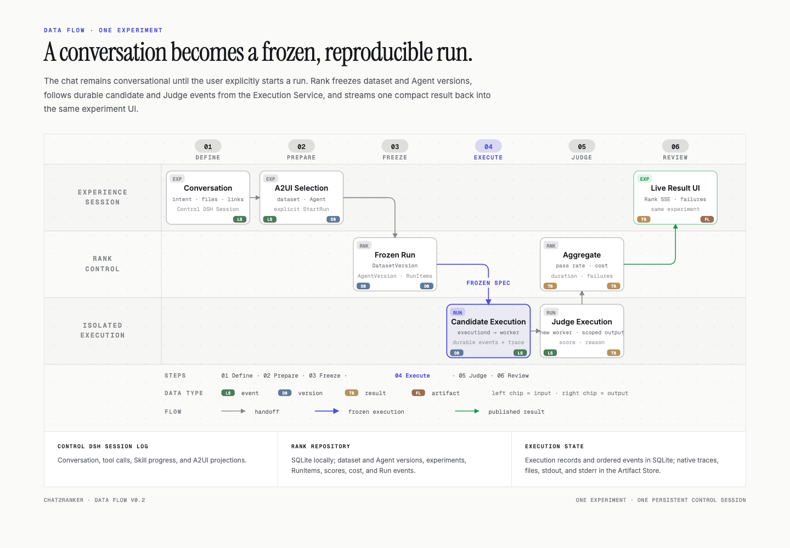

# Core data flow

This reference defines the data exchanged while preparing and running an experiment.

## Prepare an experiment

1. The browser sends an ordinary chat message to the persistent Control DSH Session.
2. The Rank Skill uses Control DSH tools to list, create, or select datasets and agent configurations through `rankd`; the same Session may use browser, web-search, and file tools while preparing cases.
3. `rankd` stores reusable immutable versions and experiment selections through its repository interface; the local assembly uses SQLite.
4. The Control DSH plugin renders dataset and agent choices as A2UI inside the conversation.
5. The composer continues to send chat messages. Only an explicit A2UI action starts a run.

## Start and execute a run

1. `rankd` receives `StartRun` with an experiment and a Trial count (default 5, range 1–20).
2. `rankd` freezes the selected DatasetVersion, AgentVersion, and EvaluatorVersion; it creates one `RunItem` per case and one `RunTrial` per Case × Trial pair.
3. The Rank scheduler submits one immutable Agent invocation for each Trial to `executiond` with a stable idempotency key.
4. `executiond` persists an `Execution` before the configured Executor starts an `execution-worker`.
5. The worker creates a private workspace and Harness Home, resolves the selected public Harness Adapter, then starts its CLI or SDK invocation.
6. Worker progress is normalized into durable Execution events. `executiond` persists the request, lifecycle, output chunks, standard output, standard error, native harness home, trace, terminal result, and Artifact references.
7. `rankd` follows Execution SSE and applies required deterministic criteria to the candidate output. A failed check ends the Trial as a valid quality failure without spending Judge tokens.
8. For a candidate that passes the gate, Rank submits one independent Judge invocation per Rubric criterion with the task, expected evidence, untrusted candidate output, and only that criterion. Each Judge receives another Execution ID, worker process, workspace, and Harness Home.
9. Rank derives each Rubric pass from its frozen score threshold, applies critical-criterion and weighted-score policy, and atomically stores the structured Trial result. Transient candidate or Judge errors receive a bounded retry; exhausted candidate errors are infrastructure failures and exhausted Judge errors are grading failures.
10. Rank aggregates valid Trial quality separately from invalid execution/grading counts, saves one case projection, finalizes the Run, and publishes ordered Run events.
11. The browser follows Rank SSE and updates Trial progress, valid-Trial pass rate, reliable cases, cost, failed cases, and trace links. Control DSH keeps the persistent experiment conversation and receives the compact terminal summary.

## Aggregation rules

- `Trial pass rate = passed valid Trials / valid Trials`; infrastructure and grading failures are never inserted into this denominator.
- `Reliable case = all scheduled Trials are valid and pass`; the default is therefore 5/5.
- `pass^3(case) = C(passed Trials, 3) / C(valid Trials, 3)` when at least three valid Trials exist; the Run value is the mean across eligible cases.
- `total cost = candidate cost + evaluation cost`; both components and the cost-known flag are retained.
- `evaluationComplete=false` whenever any Trial is excluded for infrastructure or grading failure.

## Execution input

| Field group | Examples | Rule |
|---|---|---|
| Identity | Rank run and case in metadata; execution in the service | Opaque identifiers joined through references |
| Harness | type, version, image, entry point | Frozen before dispatch |
| Agent | Runner type, preset, system prompt, model, tool IDs, Skill references | Immutable `AgentVersion` snapshot |
| Case | input, attachments, deterministic expectations, reference evidence | Immutable `DatasetVersion` snapshot |
| Evaluator | deterministic criteria, Rubric criteria, weights, critical flags, thresholds, Judge harness/model | Immutable `EvaluatorVersion` snapshot |
| Environment | workspace artifact, network policy, scoped secret references | Materialized only in the Sandbox |
| Limits | timeout, cost budget, output retention | Declared in the Execution specification and enforced by the execution plane |

## Execution output

Execution Service returns a normalized terminal result and retained native Artifact references. Its SSE stream preserves execution lifecycle plus Harness progress. Rank maps these into case-scoped candidate and Judge events, then publishes case start, output, verdict, artifact availability, completion, cancellation, recovery, and failure without importing worker internals into its business tables.

The terminal result contains final output, duration, token usage when provided, separated candidate/evaluation cost plus an explicit cost-known flag, criterion results, failure class, execution identifiers, and artifact references. Normalized data supports comparison; the retained native trace supports diagnosis.

## Judge visibility

The Judge receives only the case input, one frozen Rubric criterion, permitted tested output, reference data, and explicitly selected trace fields. Candidate output is delimited and treated as untrusted evidence, never as instructions. The Judge cannot read the control conversation, other cases, mutable dataset drafts, or credentials. Judge execution uses a separate Sandbox and execution identifier; an `unknown` or malformed verdict becomes a grading failure rather than a quality failure.
